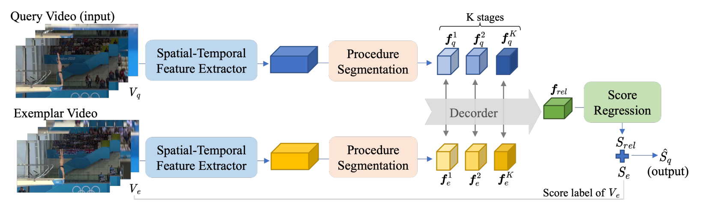
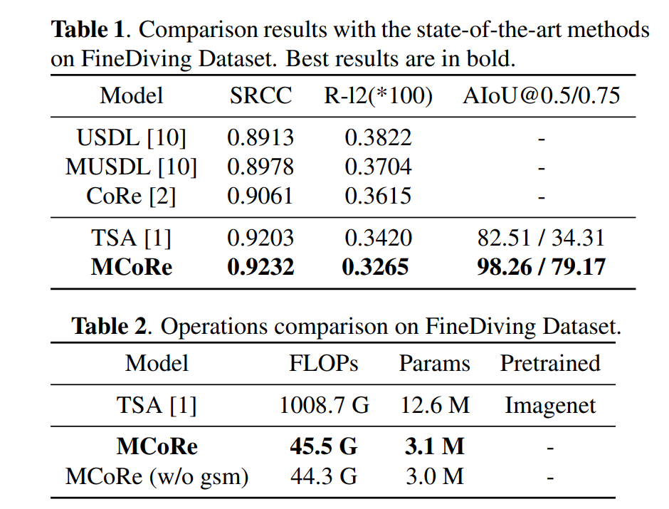

# MCoRe

This repository contains the code accompanying the paper "MULTI-STAGE CONTRASTIVE REGRESSION FOR ACTION QUALITY ASSESSMENT ", ICASSP 2024.

  <a href="https://github.com/Angel-1999">Qi An</a>1,
  <a href="https://jueduilingdu.github.io/">Mengshi Qi</a>1,
  <a href="https://scholar.google.com/citations?user=A-vcjvUAAAAJ">Huadong Ma</a>1,

  1Beijing University of Posts and Telecommunications &nbsp;&nbsp;

  

  

## Result

  

## Dependencies

This code requires an environment with 'requirements.txt'.

## Training and Evaluation

Run the bash file 'train.sh' or 'test.sh'.

